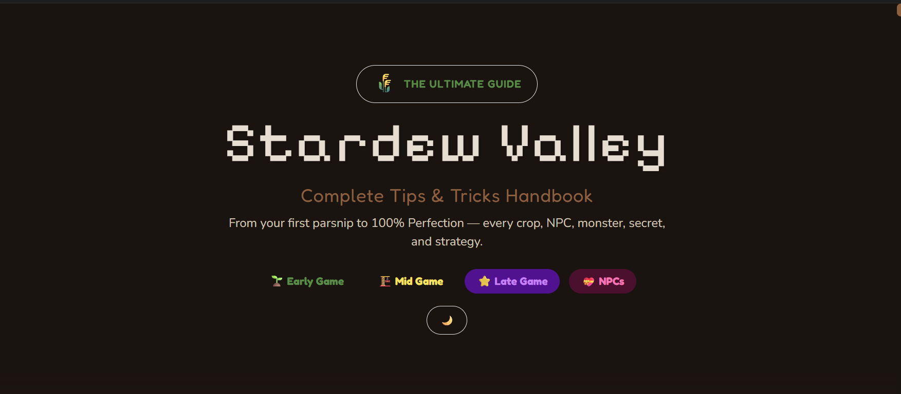

# 🌾 Stardew Valley Ultimate Guide


A comprehensive, interactive single-page guide for Stardew Valley players — from first-time farmers to 100% Perfection seekers. Covers every crop, NPC, monster, secret, fish, and bundle in the game.

## Features

- **📖 Complete Game Walkthrough** — Early, Mid, and Late game sections with step-by-step guides, priority checklists, and pro tips
- **🏡 Interactive Farm Layouts** — All 8 farm types with phase-specific layouts (Early/Mid/End-Game). Hover sprinklers to see coverage zones
- **💝 NPC Relationship Guide** — Every villager with gift preferences, birthdays, and family info in expandable cards
- **🎪 Seasonal Events Calendar** — Spring through Winter events with dates, locations, and tips
- **📦 Searchable Items Database** — Filter by category, search by name, click for details with inline modals
- **✅ Completion Checklists** — Achievements, Community Center bundles, fish collection, museum donations, and Stardrops. All progress auto-saves to localStorage
- **👾 Monster Guide** — Every enemy across all zones with HP, drops, and combat tips
- **⚙️ Mechanics Deep Dive** — Professions guide, money tier lists, skill leveling order, and crop profit formulas
- **🌙 Dark Mode** — Toggle theme; preference persists across sessions
- **📱 Fully Responsive** — Works on desktop, tablet, and mobile

## Tech Stack

| Layer       | Technology                                                                   |
| ----------- | ---------------------------------------------------------------------------- |
| Build       | [Vite 6](https://vitejs.dev/) — fast dev server, optimized production builds |
| Language    | Vanilla JavaScript (ES Modules) — no frameworks                              |
| Styling     | [Tailwind CSS](https://tailwindcss.com/) via CDN + custom CSS                |
| Data        | Static JSON imported at build time — zero runtime API calls                  |
| Interactive | CSS transitions, vanilla JS modals, localStorage persistence                 |

## Getting Started

```bash
# Install dependencies
npm install

# Start dev server at localhost:5173
npm run dev

# Build for production (outputs to dist/)
npm run build

# Preview production build locally
npm run preview
```

## Project Structure

```
├── index.html              # Entry point — all HTML sections
├── vite.config.js          # Vite configuration
├── src/
│   ├── main.js             # App entry — renders all dynamic content
│   ├── data/               # Static JSON data files (crops, NPCs, items, etc.)
│   └── scripts/            # Vanilla JS modules
│       ├── farm-renderer.js    # Farm grid tile rendering + sprinkler overlays
│       ├── modal.js             # Item detail modals
│       ├── progress-tracker.js  # Checklist persistence (localStorage)
│       ├── theme.js             # Dark/light mode toggle
│       └── utils.js             # Shared helpers
└── dist/                   # Production build output (deploy this)
```

## Deployment

Static site — deploy `dist/` anywhere:

| Platform             | Instructions                                                     |
| -------------------- | ---------------------------------------------------------------- |
| **Netlify**          | Drag `dist/` onto [app.netlify.com](https://app.netlify.com)     |
| **Vercel**           | Connect repo → auto-detects Vite                                 |
| **Cloudflare Pages** | Connect repo → set build command `npm run build`, output `dist/` |
| **GitHub Pages**     | Push `dist/` to `gh-pages` branch                                |

## License

This is an unofficial fan guide. Stardew Valley is © ConcernedApe / Eric Barone. Not affiliated with or endorsed by the developer.
